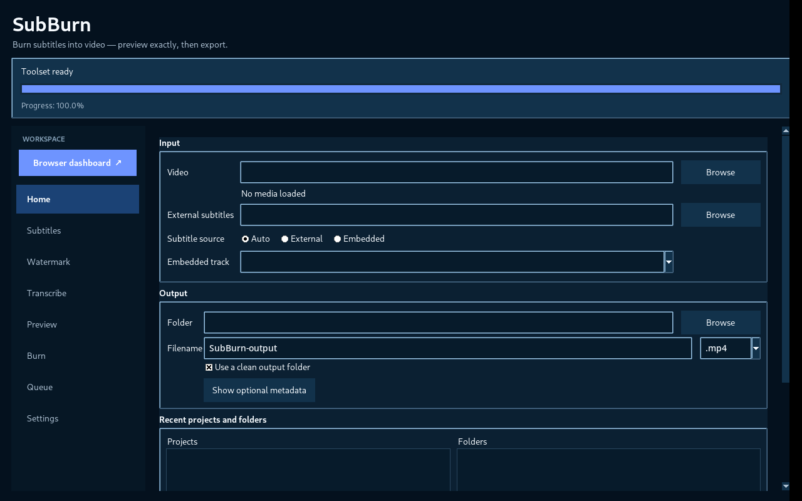

# SubBurn

SubBurn is a local-first desktop application for hard-burning subtitles into video. It combines multilingual subtitle rendering, RTL support, font fallback validation, exact rendered preview, text and image watermarks, local transcription, hardware encoder benchmarking, persistent batch processing, and a loopback-only browser dashboard.

**Made by:** Anas Al Hwaity  
**Contact Owner:** [@ANAS12RM on Telegram](https://t.me/ANAS12RM)



## What SubBurn does

- Hard-burn external or embedded subtitles into video.
- Render Arabic, Hebrew, Latin, CJK, and mixed-script subtitles through libass with HarfBuzz/FriBidi.
- Validate fonts and build deterministic fallback runs for missing glyphs.
- Preview exact rendered frames and short playback clips before encoding.
- Add text or image watermarks, including timed intervals and independent watermark fonts.
- Transcribe locally with pinned Faster-Whisper/CTranslate2 model families.
- Benchmark compatible hardware/software encoders and cache the fastest measured usable option.
- Queue multiple independent jobs without changing the currently open project.
- Control the same running SubBurn session from Tkinter or the local browser dashboard.
- Report operation progress through one shared canonical progress engine.

## Normal workflow

1. Open a video.
2. Choose external/embedded subtitles or transcribe locally.
3. Style subtitles and optional watermarking.
4. Render an exact preview frame or short clip.
5. Choose encoding settings.
6. Burn and verify the output.

The desktop includes a prominent **Browser dashboard** launcher with `Ctrl+B`. The Tkinter interface and browser dashboard are two views over the same state, operation, queue, and progress engine.

## Performance

SubBurn keeps the fast rendering lessons of the original subtitle-only burner without removing the newer features:

- subtitle-only jobs use a minimal single libass filter pass;
- subtitle + text-watermark jobs are merged into one libass pass when compatible;
- font fallback resolution is cached across long subtitle files;
- compatible hardware encoders are measured rather than guessed;
- audio can be stream-copied when the selected settings allow it;
- optimizations are not allowed to silently change codec, quality, bitrate, resolution, frame rate, subtitle style, watermark settings, or explicit encoder selection.

See [`docs/performance.md`](docs/performance.md).

## Progress and reporting

Progress reporting is part of the product contract:

- determinate percentages are shown only when SubBurn has a real denominator;
- unknown-duration preparation stages stay indeterminate instead of inventing percentages;
- downloads report percentage, downloaded/total bytes, speed, and ETA separately;
- encodes report percentage, FPS, encode speed, ETA, and elapsed time;
- elapsed time and final metrics freeze when an operation reaches success, failure, or cancellation;
- stale/background operations cannot overwrite newer foreground progress;
- 100% is reserved for verified completion.

## FFmpeg

SubBurn checks FFmpeg in this order:

1. compatible system/PATH FFmpeg;
2. user-selected FFmpeg executable or folder;
3. checksum-verified managed SubBurn runtime.

A candidate must include a compatible FFmpeg/FFprobe pair and the rendering filters SubBurn needs, including libass-backed subtitle rendering. Managed Windows runtime installation is designed for reuse after restart.

## Queue

The persistent SQLite queue supports:

- add current project;
- add another video without changing the current project;
- add a recent saved project;
- add folder video/subtitle pairs;
- duplicate jobs intentionally;
- reorder jobs;
- remove one or multiple jobs;
- cancel and remove the current running job;
- retry failed jobs;
- clear queued or completed jobs;
- restart recovery for interrupted queue state.

## Help Manual

The application contains a Help Manual directly in **Settings**. The repository copy is available at [`docs/help-manual.md`](docs/help-manual.md).

## Source installation

Python 3.10 to 3.13 is the current source-install target range. Tk/Tcl must be supplied by the Python/OS installation.

```bash
python -m venv .venv
# activate the virtual environment
python -m pip install -e .
python -m subburn
```

Optional drag-and-drop:

```bash
python -m pip install -e '.[dragdrop]'
```

Optional local transcription:

```bash
python -m pip install -e '.[transcription]'
```

Everything:

```bash
python -m pip install -e '.[full]'
```

## Security and privacy

- The dashboard binds to loopback only.
- A per-session authenticated cookie protects dashboard API calls.
- Local subtitle burning does not require a remote API.
- Network access is expected only for explicitly required runtime/model downloads and normal package installation workflows.
- Source-secret scanning and dependency/release checks are included in the repository acceptance suite.

See [`SECURITY.md`](SECURITY.md).

## Distribution

The planned Windows end-user distribution is a per-user, non-admin installer around a PyInstaller one-folder application. FFmpeg and transcription model weights remain verified on-demand assets rather than being bundled silently.

See [`docs/distribution.md`](docs/distribution.md) and [`docs/release-readiness.md`](docs/release-readiness.md).

## Documentation

- [Help Manual](docs/help-manual.md)
- [Compatibility](docs/compatibility.md)
- [Performance](docs/performance.md)
- [Dependencies](docs/dependencies.md)
- [Distribution](docs/distribution.md)
- [SBOM policy](docs/sbom.md)
- [Transcription model policy](docs/transcription-model-policy.md)
- [Release process](docs/release-process.md)
- [Release readiness](docs/release-readiness.md)
- [Support](SUPPORT.md)

## Contributing

Contributions are welcome. Read [`CONTRIBUTING.md`](CONTRIBUTING.md), [`CODE_OF_CONDUCT.md`](CODE_OF_CONDUCT.md), and the issue/PR templates before submitting changes.

## License

SubBurn source is licensed under Apache-2.0. Third-party software, FFmpeg builds, fonts, TkDND, Python dependencies, and transcription model weights retain their respective licenses. See [`THIRD_PARTY_NOTICES.md`](THIRD_PARTY_NOTICES.md).
