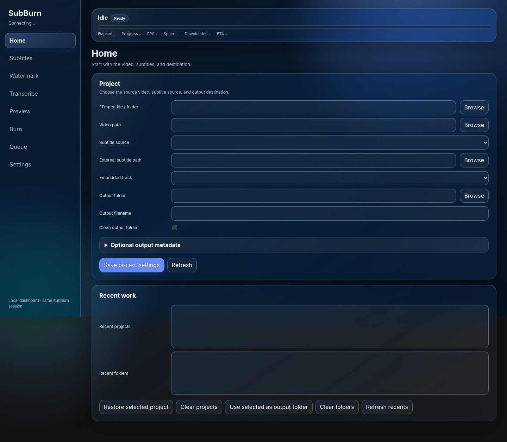

# SubBurn

SubBurn burns subtitles into video and gives you the tools around that job in one desktop app: subtitle styling, RTL text, font fallback, watermarks, transcription, exact previews, encoder selection, progress reporting, and a persistent queue.

Made by **Anas Al Hwaity**  
Telegram: [@ANAS12RM](https://t.me/ANAS12RM)

## Desktop


## Browser dashboard



The dashboard controls the same running SubBurn session as the desktop window. It stays on the local machine.

## Run from source

Python 3.10 to 3.13 is supported.

```bash
python SubBurn.py
```

## What it handles

- External and embedded subtitles
- Arabic, Hebrew, Latin, CJK, and mixed-script text
- Subtitle font fallback and glyph checks
- Text and image watermarks
- Local transcription
- Exact frame and short-clip previews
- Hardware and software encoder selection
- FFmpeg discovery and managed fallback
- Saved projects and persistent batch jobs
- Tkinter and browser controls over the same session

## Workflow

A normal SubBurn job goes from source video to finished output in one workflow:

1. **Choose the video** you want to process.
2. **Choose the subtitle source.** Use an external subtitle file, an embedded subtitle track, or generate subtitles locally with transcription.
3. **Prepare the subtitles.** Select fonts, styling, positioning, RTL handling, font fallback, and other subtitle options needed for the video.
4. **Add a watermark if needed.** SubBurn supports text and image watermarks alongside subtitles.
5. **Preview before encoding.** Render an exact frame or short clip to check subtitle placement, fonts, RTL text, watermark placement, and the final visual result.
6. **Choose the output and encoder.** SubBurn detects available hardware and software encoders and lets you select how the finished video will be encoded.
7. **Start the job or add it to the queue.** A single project can run immediately, while multiple projects can be saved and processed through the persistent batch queue.
8. **Follow real progress.** The desktop app and browser dashboard show the same running job, including progress, elapsed time, speed, and other available status information.
9. **Receive the finished video.** When FFmpeg completes successfully, SubBurn writes the processed video to the selected output location.

The queue survives app restarts, so unfinished or saved batch work can be recovered and continued later.

A full help manual is built into **Settings** inside the app.

## License

SubBurn is licensed under Apache-2.0. Third-party components keep their own licenses. See `THIRD_PARTY_NOTICES.md`.
